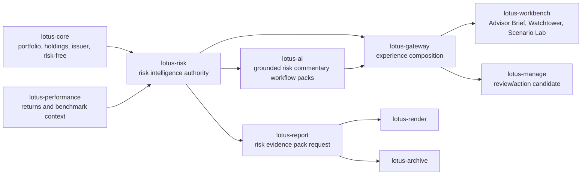

# RFC-0009: Enterprise Risk Intelligence Operating Layer

| Metadata | Details |
| --- | --- |
| **Status** | DRAFT - GOLD-STANDARD IMPLEMENTATION PLAN |
| **Created** | 2026-05-24 |
| **Owner** | `lotus-risk` for risk analytics, risk evidence packets, attention events, scenario-pack authority, risk methodology, supportability, lineage, and risk-domain product truth |
| **Business Sponsor Persona** | private banker, relationship manager, CIO desk, discretionary portfolio manager, investment risk officer, compliance reviewer, model-risk reviewer, operations support, audit, sales/pre-sales |
| **Primary Business Outcome** | turn `lotus-risk` from a calculation service into a bank-buyable private-banking risk intelligence operating layer with advisor-ready risk explanation, book-level attention, CIO scenario workflows, governed AI commentary, audit evidence, and cross-app action handoff |
| **Requires Approval From** | `lotus-risk`, `lotus-gateway`, `lotus-workbench`, `lotus-ai`, `lotus-manage`, `lotus-report`, `lotus-render`, `lotus-archive`, `lotus-core`, `lotus-performance`, and `lotus-platform` maintainers where handoff proof is required |
| **Depends On** | lotus-risk RFC-0003 through RFC-0008; platform RFC-0067, RFC-0071, RFC-0072, RFC-0073, RFC-0082, RFC-0084, RFC-0087, RFC-0091, RFC-0093, RFC-0094, RFC-0096, RFC-0108; lotus-advise RFC-0023; lotus-manage RFC-0038, RFC-0039, RFC-0040, RFC-0041, RFC-0042, RFC-0043 |
| **Cross-Repository Scope** | `lotus-risk` owns the risk products; `lotus-gateway` composes; `lotus-workbench` renders; `lotus-ai` drafts bounded commentary; `lotus-manage` consumes reviewed attention/action candidates; `lotus-report`, `lotus-render`, and `lotus-archive` materialize governed evidence; `lotus-platform` owns reusable validation, mesh, and governance automation |
| **Compatibility Posture** | strategic-reset allowed. Backward compatibility is not required for RFC-0009 when a cleaner product contract is the right design. Any breaking API, contract, route, data-product, or payload change must update every affected upstream and downstream Lotus repository inside this RFC before the capability is promoted. No compatibility shim may survive unless it is explicitly justified, tested, documented, and time-boxed in the slice evidence. |
| **No Second-Wave Rule** | no follow-up RFC, WTBD ledger, or second implementation wave may contain work required for RFC-0009's bank-buyable product claim. Required upstream, downstream, platform, AI, report, archive, Manage, Workbench, Gateway, docs, CI, security, and data-mesh changes belong in this RFC. If a required item cannot be delivered, the supported product claim must be narrowed before closure. |
| **Implementation Branching Rule** | use one coherent RFC-0009 feature branch or one remote branch per slice; every branch, PR, commit, check, evidence directory, wiki publication commit, and closure state must be recorded in slice evidence |
| **Stranded-Truth Reconciliation** | `git fetch origin --prune` and `git branch -r --no-merged origin/main` were run before RFC creation; no unmerged `lotus-risk` remote branches were returned |
| **Doc Location** | `docs/rfcs/RFC-0009-enterprise-risk-intelligence-operating-layer.md` |

---

## 0. Executive Summary

`lotus-risk` already has credible analytics: risk metrics, drawdown, rolling risk, concentration,
historical attribution, mandate risk health context, regime scenario-pack evaluation, risk-event
cohorts, supportability metadata, audit lineage, and explicit product-surface preservation rules.

That is necessary but not sufficient for a bank-buyable product.

Private banks do not buy a raw metric engine only. They buy an operating layer that helps front
office, CIO, PM, compliance, risk, operations, and audit answer:

1. Which client or mandate needs attention now?
2. Which risk driver matters?
3. Is the evidence complete, fresh, and supportable?
4. What can the relationship manager say safely?
5. Which CIO scenario or house view changed the posture?
6. Should a discretionary portfolio-management review be opened?
7. Can every claim be replayed, audited, and defended?

RFC-0009 defines that enterprise-grade product: the **Enterprise Risk Intelligence Operating
Layer**. It is not an MVP and not a chatbot. It is a cross-app, evidence-first, review-gated,
AI-assisted risk operating program.

The core product outcomes are:

1. **Advisor Brief Risk Lens**
   risk evidence inside the existing Advisor Brief surface, not a disconnected second brief.
2. **Risk Watchtower**
   book-level attention events that identify portfolios needing review.
3. **CIO Scenario Lab**
   governed scenario packs that turn house views and market shocks into portfolio-specific impact,
   client talking points, and DPM review candidates.
4. **Risk Evidence Center**
   audit-ready risk evidence packets, model cards, methodology refs, supportability, lineage,
   replay, and approval posture.
5. **Grounded AI Risk Commentary**
   AI-assisted language generated only from deterministic risk evidence and reviewed before
   downstream use.

This RFC cannot close as "risk backend done, product later" or "AI prompt done, evidence later".
It can close only when risk-owned contracts, Gateway composition, Workbench product surfaces,
AI guardrails, report/render/archive evidence, Manage handoff, model-risk governance,
observability, documentation, wiki, and branch hygiene are implementation-backed and mainline.

The RFC is intentionally allowed to change existing APIs and downstream contracts where that is the
cleaner enterprise design. The cost of breaking change must be paid inside this RFC through
same-RFC upstream/downstream migration, tests, OpenAPI, data-product declarations, docs, wiki,
supported-features updates, and live evidence.

---

## 1. Source-Informed Market Pattern

Public market research performed before this RFC identified a durable industry pattern:

1. leading platforms combine risk analytics, portfolio management, advisor nudges, model
   management, proposal/report generation, and book-level oversight;
2. AI is being used for advisor commentary, research summarization, next-best-action style
   assistance, and operational productivity;
3. private-bank buyers care about total portfolio context, public/private assets, scenarios,
   governance, model-risk controls, compliance review, and evidence quality;
4. the defensible premium position is not "AI recommends trades", but "AI helps explain and route
   source-backed risk evidence safely".

Durable external references used as market context:

1. BlackRock Aladdin Wealth public product material for connected wealth risk, advisor nudges,
   book insights, model management, proposal generation, and whole-portfolio view:
   `https://www.blackrock.com/aladdin/products/aladdin-wealth`.
2. BlackRock/Morgan Stanley AI-enabled commentary announcement for portfolio-risk narrative:
   `https://www.blackrock.com/aladdin/discover/aladdin-wealth-launches-ai-enabled-commentary-tool-at-morgan-stanley`.
3. MSCI Wealth Manager public material for factor-based alignment, stress tests, tailored reports,
   public/private asset views, and portfolio misalignment monitoring:
   `https://www.msci.com/data-and-analytics/wealth-management/msci-wealth-manager`.
4. BNY Pershing Wove advisory material for integrated research, analytics, models, construction,
   risk, proposal, trading, and AI/ML-assisted planning:
   `https://www.bny.com/pershing/us/en/platforms/wove/advisory.html`.
5. HSBC Wealth Intelligence public release for GenAI-enabled research/news summarization and
   personalized investment strategy support:
   `https://www.about.hsbc.com.sg/news-and-media/hsbc-deploys-wealth-intelligence-for-its-wealth-management-staff-to-enhance-client-experience`.
6. Bank of Singapore SOWA public release for agentic AI with human verification, accuracy,
   consistency, regulatory alignment, and relationship-manager productivity:
   `https://www.bankofsingapore.com/media-releases/2025/bank-of-singapore-deploys-agentic-ai-tool-to-automate-writing-of-source-of-wealth-reports.html`.
7. Federal Reserve SR 11-7 model-risk guidance for model development, implementation, validation,
   governance, policies, and controls:
   `https://www.federalreserve.gov/frrs/guidance/supervisory-guidance-on-model-risk-management.htm`.

These sources are market context only. They are not implementation authority. Lotus implementation
truth remains the repo code, contracts, tests, RFCs, platform standards, and live evidence.

### 1.1 Gold-Standard Internal Patterns Reviewed

RFC-0009 also adopts implementation-RFC depth from current Lotus examples:

1. `lotus-advise/docs/rfcs/RFC-0023-grounded-advisory-ai-narrative-and-client-ready-proposal-commentary.md`
   for grounded AI, review gating, workflow-pack evidence, and client-ready narrative controls.
2. `lotus-manage/docs/rfcs/RFC-0040-pre-trade-proof-pack-and-evidence-fabric.md`
   for proof-pack, evidence fabric, downstream action lifecycle, and source-authority discipline.
3. `lotus-performance/docs/RFCs/RFC-047-*`
   for platform automation/scaffolding slice depth, analytics data-product hardening, implementation
   proof, second-last hardening, final closure, and post-completion LinkedIn communication.

Those internal patterns are not copied blindly. RFC-0009 uses them to set the execution bar for
risk intelligence: source-backed analytics, full downstream realization, data-mesh posture,
platform-level reusable improvements, live evidence, final documentation, and truthful public
communication.

---

## 2. Critical Review of Current Lotus Risk Posture

| Area | Current State | Gap for Bank-Buyable Product | RFC-0009 Direction |
| --- | --- | --- | --- |
| Risk calculations | Strong methodology-pinned risk metrics, drawdown, rolling metrics, concentration, attribution, scenario-pack, risk-event cohort, and mandate-health context. | Outputs are still mostly endpoint-level analytics rather than a unified front-office risk operating product. | Create risk evidence packets, attention events, Advisor Brief Risk Lens, Watchtower, Scenario Lab, and reportable evidence packs. |
| Advisor Brief | Existing product surface is Gateway/Workbench backed, AI workflow-pack enabled, review-gated, and evidence-aware, but currently performance-centered. | Adding a separate risk brief would fragment the advisor workflow. | Extend Advisor Brief with a risk lens sourced from `lotus-risk` while preserving risk authority. |
| Book-level risk | Risk-event cohorts exist, but no persistent prioritized book-level attention queue. | Private bankers and CIO teams need "who needs attention today and why". | Add `RiskAttentionEvent:v1`, Watchtower evaluation, prioritization, lifecycle, and review state. |
| CIO scenarios | `RegimeScenarioPackEvaluation:v1` is implemented and methodology-backed. | Scenario use is not yet a full CIO workflow with scenario registry, governance posture, natural-language draft support, applicability, book impact, and advisor commentary. | Add governed Scenario Lab built on risk-owned scenario definitions, not browser-owned methodology. |
| AI | `lotus-ai` can support Advisor Brief workflow packs. | AI must not invent risk facts, thresholds, methodology, advice, trades, suitability, or client messages. | Add grounded risk commentary from deterministic evidence packets with guardrails, review, and replay. |
| Audit/model risk | RFC-0008 adds lineage and methodology posture. | Bank buyers need a coherent model-risk evidence center: model cards, validation results, methodology versions, data lineage, supportability, replay, and approvals. | Add risk model governance artifacts, validation manifests, model cards, and reviewer evidence. |
| Cross-app action | Manage can consume risk health/scenario/event products, but there is no full risk-to-action flow. | Premium risk intelligence needs routeable review/action candidates without pretending to execute trades. | Add reviewed handoff to `lotus-manage` for DPM review candidates and action-register lineage. |
| Product proof | Canonical evidence exists, but broader live portfolio archetype coverage remains bounded. | Enterprise claim requires more archetypes, degraded-source proof, UI proof, report proof, AI proof, and branch hygiene. | Make canonical plus archetype validation a required implementation slice. |

Decision:

1. RFC-0009 is the owning RFC for the bank-buyable `lotus-risk` product enhancement.
2. RFC-0009 must preserve existing risk contract truths from RFC-0008.
3. RFC-0009 must use the existing Advisor Brief as the first advisor narrative surface.
4. RFC-0009 must not move risk calculation authority to Gateway, Workbench, Manage, Report, or AI.
5. RFC-0009 must not defer required product realization to a follow-up RFC or WTBD item.

### 2.1 RFC Tightening Review

This tightening pass found and corrected these pre-implementation gaps:

| Finding | Why It Was Not Gold Standard | RFC-0009 Correction |
| --- | --- | --- |
| Compatibility language was too conservative. | A bank-buyable product should not keep weak API boundaries only to preserve old route shape. | RFC-0009 now permits strategic breaking changes and requires all consumers to be migrated inside the same RFC. |
| Platform automation was framed as a review only. | Reusable scaffolding gaps must be fixed in `lotus-platform`, not repeatedly patched in each app. | Slice 1 now requires a platform automation/scaffolding gap ledger and platform PRs for reusable defaults. |
| Data-product posture was embedded inside API certification. | `lotus-risk` must become a governed data product, not just a FastAPI service with good endpoints. | Slice 10 is now the explicit Data Product and Platform Hardening slice with mesh, SLO, access, evidence, trust telemetry, and discovery requirements. |
| Cleanup did not fully address document sprawl and wiki truth. | Enterprise docs become unreliable when repo docs and wiki repeat conflicting claims. | Slice 2 and final closure now require duplicate-doc cleanup, wiki source discipline, and post-merge publication. |
| Final closure and public communication were combined. | A LinkedIn post should happen only after implementation proof and final closure evidence exist. | Slice 19 closes implementation truth; Slice 20 separately drafts post-completion communication using the LinkedIn content system. |
| Documentation requirements were too generic. | Bank-buyable documentation must describe actual behavior, constraints, APIs, evidence, and unsupported states. | Documentation gates now require detailed implementation-backed docs and prohibit aspirational product wording. |
| CI/security/platform compliance was too implicit. | Implementation teams need explicit gates, async GitHub monitoring, and fix-forward expectations. | Slices 1, 10, 15, 18, and 19 now require CI, security, platform compliance, and pipeline monitoring evidence. |
| Supported-feature promotion criteria were too thin. | Business/demo claims must map to concrete endpoints, surfaces, consumers, and proof artifacts. | The supported-features ledger now includes owner, state, required surfaces, evidence, and publication targets. |

---

## 3. Business Outcomes

RFC-0009 must deliver these outcomes:

1. **Premium advisor conversation quality**
   private bankers receive concise risk talking points backed by metrics, drivers, scenarios,
   supportability, and evidence refs.
2. **Risk-aware client prioritization**
   advisors and CIO teams see a prioritized attention queue across their book, not isolated charts.
3. **CIO house-view execution**
   risk scenarios and events can be turned into affected portfolios, client-ready discussion
   prompts, and optional DPM review candidates.
4. **Compliance and model-risk confidence**
   every narrative claim, threshold, risk event, scenario result, and downstream handoff is
   traceable to source evidence and replayable.
5. **DPM action readiness**
   reviewed risk attention can open a bounded `lotus-manage` review/action candidate without
   creating orders, client communications, or autonomous advice.
6. **Sales/pre-sales credibility**
   Lotus can demo a private-bank risk operating layer with implementation-backed claims, not
   generic dashboards or unsupported AI.
7. **Operational supportability**
   risk-intelligence outputs carry freshness, degraded-source posture, lineage, latency,
   correlation, safe diagnostics, and evidence-pack links.

---

## 4. Non-Goals

RFC-0009 does not:

1. create autonomous investment advice,
2. approve trades,
3. contact clients,
4. replace suitability or best-interest review owned by advisory policy workflows,
5. replace `lotus-manage` DPM execution authority,
6. replace `lotus-report`, `lotus-render`, or `lotus-archive` document lifecycle,
7. make `lotus-gateway` or `lotus-workbench` a risk methodology owner,
8. support browser-authored scenario methodology,
9. claim regulatory capital model approval,
10. expose raw prompts, raw model responses, holdings-level sensitive content, restricted
    telemetry paths, or entitlement details in public docs, logs, metrics, or evidence packs.

---

## 5. Architecture Direction

### 5.1 Ownership Model

`lotus-risk` owns:

1. risk evidence packet domain model,
2. risk attention event model and thresholds,
3. scenario-pack definitions, applicability, effective-period posture, and evaluation semantics,
4. risk methodology versions and model cards,
5. supportability, degraded-source posture, and lineage,
6. risk data-product declarations and trust telemetry,
7. risk API contracts and OpenAPI truth.

`lotus-gateway` owns:

1. Advisor Brief risk-lens composition,
2. Watchtower and Scenario Lab experience API contracts,
3. entitlement and caller-context propagation,
4. correlation propagation and bounded audit events,
5. downstream composition without risk methodology reconstruction.

`lotus-workbench` owns:

1. Advisor Brief Risk Lens UI,
2. Risk Watchtower UI,
3. CIO Scenario Lab UI,
4. evidence drawers, review actions, and drilldowns,
5. browser validation and screenshot proof through governed runtime flows.

`lotus-ai` owns:

1. bounded workflow-pack execution,
2. model/provider telemetry,
3. AI surface supportability,
4. review-gated generated commentary,
5. no-sensitive-content and unsupported-claim controls.

`lotus-manage` owns:

1. DPM review/action candidate lifecycle,
2. mandate action-register persistence,
3. PM operating quality linkage,
4. no-trade/no-client-communication boundary enforcement.

`lotus-report`, `lotus-render`, and `lotus-archive` own:

1. risk intelligence evidence report materialization,
2. deterministic rendering,
3. archive, retrieval, retention, legal hold, access audit, and evidence publication posture.

`lotus-core` and `lotus-performance` remain source authorities for portfolio, holdings,
transactions, benchmark, returns, risk-free, exposure, issuer, and source-data inputs.

### 5.2 Product Flow

Rules:

1. Workbench must consume Gateway/BFF, not direct `lotus-risk`.
2. Gateway must not calculate risk methodology or scenario impact locally.
3. AI must consume risk evidence packets, not raw unrestricted portfolio payloads.
4. Manage may consume reviewed risk attention and scenario evidence, but must not infer risk facts
   or execute orders from an AI narrative.
5. Report/render/archive materialize reviewed evidence; they must not rewrite risk methodology.

### 5.3 Same-RFC Upstream and Downstream Change Rule

RFC-0009 is a product-realization RFC, not a risk-service-only RFC.

If implementation changes any upstream or downstream contract, the owning slice must update every
affected repository in the same RFC execution flow:

1. `lotus-core` and `lotus-performance` source APIs and source-data supportability,
2. `lotus-risk` calculation, evidence, data-product, telemetry, and OpenAPI truth,
3. `lotus-gateway` BFF and experience contracts,
4. `lotus-workbench` product surfaces and browser proof,
5. `lotus-ai` workflow packs, guardrails, provider posture, and review state,
6. `lotus-manage` reviewed DPM action-candidate consumption,
7. `lotus-report`, `lotus-render`, and `lotus-archive` evidence-pack materialization,
8. `lotus-platform` scaffolding, validators, mesh catalogs, policy contracts, and CI governance.

Rules:

1. no required downstream consumer may remain on stale endpoints after closure;
2. no route, endpoint, payload field, or data-product alias may be kept only to avoid updating a
   consumer;
3. every breaking change must include owner, migration action, tests, OpenAPI/docs impact,
   supported-feature impact, and live proof;
4. a temporary compatibility shim is allowed only when explicitly approved in slice evidence, with
   a removal condition inside RFC-0009;
5. branch and PR evidence must show all cross-repository changes merged and validated before
   RFC-0009 is marked implemented.

---

## 6. Target Products and Contracts

### 6.1 `RiskIntelligenceEvidencePacket:v1`

Purpose:
unify deterministic risk evidence for advisor brief, Watchtower, Scenario Lab, report, AI, audit,
and Manage handoff consumers.

Required fields:

1. `packet_id`
2. `portfolio_id`
3. `as_of_date`
4. `requested_period`
5. `evidence_scope`
6. `risk_metrics_summary`
7. `drawdown_summary`
8. `rolling_risk_summary`
9. `concentration_summary`
10. `historical_attribution_summary`
11. `scenario_summary`
12. `risk_event_summary`
13. `drivers`
14. `threshold_breaches`
15. `supportability`
16. `source_refs`
17. `methodology_refs`
18. `lineage`
19. `model_risk_refs`
20. `safe_ai_context`
21. `redaction_profile`

### 6.2 `RiskBriefLens:v1`

Purpose:
the risk-owned evidence slice consumed by the existing Advisor Brief.

Required fields:

1. `summary_posture`
2. `top_risk_talking_points`
3. `risk_metrics`
4. `risk_drivers`
5. `scenario_sensitivities`
6. `risk_exceptions`
7. `supportability`
8. `advisor_brief_evidence_refs`
9. `risk_review_routes`
10. `ai_grounding_packet_ref`

### 6.3 `RiskAttentionEvent:v1`

Purpose:
book-level risk Watchtower output.

Required fields:

1. `event_id`
2. `portfolio_id`
3. `book_id`
4. `attention_type`
5. `severity`
6. `priority_score`
7. `metric_driver`
8. `current_value`
9. `threshold`
10. `change_since_prior`
11. `scenario_context`
12. `supportability_state`
13. `source_refs`
14. `recommended_review_action`
15. `advisor_brief_route`
16. `risk_review_route`
17. `manage_handoff_eligibility`
18. `review_state`
19. `created_at`
20. `expires_at`

### 6.4 `CioScenarioLabRun:v1`

Purpose:
scenario workflow output for CIO/PM/RM review.

Required fields:

1. `scenario_run_id`
2. `scenario_pack_id`
3. `scenario_pack_version`
4. `scenario_name`
5. `scenario_definition_ref`
6. `house_view_ref`
7. `effective_period`
8. `portfolio_universe`
9. `portfolio_impacts`
10. `top_affected_portfolios`
11. `driver_decomposition`
12. `supportability`
13. `governance_evidence`
14. `advisor_brief_insertions`
15. `watchtower_events_created`
16. `manage_review_candidates`
17. `ai_commentary_run_ref`
18. `lineage`

### 6.5 `RiskModelGovernanceEvidence:v1`

Purpose:
model-risk and audit evidence center.

Required fields:

1. `methodology_id`
2. `methodology_version`
3. `model_card_ref`
4. `validation_manifest_ref`
5. `test_evidence_refs`
6. `live_evidence_refs`
7. `known_limitations`
8. `approved_use_cases`
9. `prohibited_use_cases`
10. `data_dependencies`
11. `supportability_metrics`
12. `review_owner`
13. `last_reviewed_at`
14. `next_review_due_at`

### 6.6 Data Product and Data Mesh Target Posture

`lotus-risk` must emerge from RFC-0009 as a true governed data-product producer, not only as an
API service with analytic endpoints.

Every RFC-0009 product promoted to supported state must define:

1. stable product id, semantic version, owner, steward, lifecycle state, approved consumers, and
   prohibited uses;
2. schema, examples, field descriptions, error bodies, and versioning policy;
3. freshness, completeness, coverage, quality, reconciliation, lineage, and source-readiness
   semantics;
4. trust telemetry snapshot or runtime telemetry path, including generated/as-of dates,
   correlation/request fingerprints, source dependencies, data-quality state, and coverage state;
5. mesh SLO policy, access policy, evidence policy, and access-class mapping for customer,
   advisor, operator, audit, and internal evidence;
6. domain-product producer declaration in `lotus-risk` and consumer declarations in downstream
   repositories where consumption is material;
7. platform-generated catalog, dependency graph, trust certification, and mesh evidence-pack
   refresh where required;
8. Gateway publication and Workbench discovery behavior when the product is intended for
   self-serve data-product discovery;
9. implementation-backed README/wiki/supported-features wording that separates supported products,
   gated products, and removed unsupported claims.

Mesh posture is part of the product contract. A risk intelligence feature is not supported merely
because an endpoint exists; it is supported only when the producer declaration, trust telemetry,
SLO/access/evidence policies, API certification, consumer proof, and live evidence are complete for
that feature's declared scope.

---

## 7. Proposed API Surface

Final endpoint naming must be certified during the API slice, but implementation should start from
this target surface:

| Endpoint | Owner | Purpose | Initial Contract Decision |
| --- | --- | --- | --- |
| `POST /analytics/risk/intelligence/evidence-packets` | `lotus-risk` | Build deterministic risk evidence packet for one portfolio. | Additive, source-backed, no AI text. |
| `GET /analytics/risk/intelligence/evidence-packets/{packet_id}` | `lotus-risk` | Retrieve persisted/replayable evidence packet. | Required only after persistence slice. |
| `POST /analytics/risk/intelligence/brief-lens` | `lotus-risk` | Produce Advisor Brief risk lens from evidence packet or request context. | Risk-owned input to existing Advisor Brief. |
| `POST /analytics/risk/intelligence/attention-events/evaluate` | `lotus-risk` | Evaluate portfolio or book and produce `RiskAttentionEvent:v1` rows. | No client contact, no trade instruction. |
| `GET /analytics/risk/intelligence/attention-events` | `lotus-risk` | Query persisted attention events by book, portfolio, severity, state, and date. | Requires entitlement-aware Gateway consumption. |
| `POST /analytics/risk/intelligence/scenario-lab/runs` | `lotus-risk` | Execute governed scenario lab run across portfolio universe. | Builds on `RegimeScenarioPackEvaluation:v1`; no browser-owned methodology. |
| `GET /analytics/risk/intelligence/scenario-lab/runs/{scenario_run_id}` | `lotus-risk` | Retrieve scenario lab run and supportability. | Required for replay and report evidence. |
| `GET /analytics/risk/intelligence/model-governance` | `lotus-risk` | Publish model/methodology governance evidence. | Operator/model-risk surface; access class must be governed. |
| `GET /integration/capabilities` | `lotus-risk` | Publish new features/workflows and mode support. | Must include risk intelligence features only after implementation-backed support. |

Gateway and Workbench route decisions:

1. The first advisor-facing surface should extend existing
   `/api/v1/workbench/{portfolio_id}/performance/advisor-brief` with a `risk_lens` field.
2. If Slice 0 decides the correct product route is a portfolio-level Advisor Brief route such as
   `/api/v1/workbench/{portfolio_id}/portfolio/advisor-brief`, the rename must be implemented in
   RFC-0009 across Gateway, Workbench, AI workflow packs, docs, tests, and supported-features truth;
   it must not be deferred to a later compatibility RFC.
3. Watchtower and Scenario Lab should receive separate Gateway/Workbench surfaces because they are
   book/CIO workflows, not single-period performance brief details.

---

## 8. Source Authority and Dependency Map

| Domain | Source Owner | RFC-0009 Use | Forbidden Local Behavior |
| --- | --- | --- | --- |
| Portfolio identity, holdings, transactions, issuer, reference data, risk-free series | `lotus-core` | source stateful risk inputs and supportability evidence | browser or AI invents holdings, issuer hierarchy, or risk-free assumptions |
| Returns, benchmark returns, benchmark exposure context | `lotus-performance` | source risk, rolling, attribution, active-risk, and benchmark context | risk or Gateway locally reconstructs performance methodology |
| Risk metrics, drawdown, rolling risk, attribution, concentration, scenario, risk event, attention events | `lotus-risk` | compute and publish risk intelligence products | Gateway, Workbench, AI, Manage, or Report changes risk meaning |
| Advisor brief composition | `lotus-gateway` | compose performance plus risk lens plus AI posture | Gateway calculates risk values or drops lineage |
| Product UI | `lotus-workbench` | render brief, Watchtower, Scenario Lab, evidence drawer | browser computes risk or scenario impact |
| Narrative execution | `lotus-ai` | generate bounded risk commentary from evidence packets | AI owns risk facts, suitability, advice, or order intent |
| DPM review/action lifecycle | `lotus-manage` | consume reviewed attention/scenario evidence | Manage recalculates risk methodology or creates orders from unreviewed events |
| Report generation | `lotus-report` | consume reviewed risk evidence packet | report reconstructs risk calculations |
| Rendering | `lotus-render` | deterministic rendering | render mutates risk facts |
| Archive | `lotus-archive` | retention, retrieval, access audit | archive exposes restricted telemetry or raw sensitive payloads |
| Platform governance | `lotus-platform` | validation, mesh, wiki, CI, automation, canonical proof | app-local duplicate governance patterns |

---

## 9. Implementation Slices

### Slice 0: Critical Review, Source Map, and Product Gap Allocation

Outcome:
turn this RFC into executable source-map truth before code begins, with all ambiguity resolved or
removed from the supported product claim.

Required work:

1. inventory current `lotus-risk` APIs, contracts, data products, docs, tests, wiki, and OpenAPI;
2. inspect current Advisor Brief contracts in `lotus-gateway`, `lotus-workbench`, and `lotus-ai`;
3. inspect `lotus-manage` consumption paths for mandate health, scenario-pack, risk-event cohort,
   proof-pack, wave, outcome, and PM-quality flows;
4. produce `docs/rfcs/RFC-0009-source-map-and-gap-analysis.md`;
5. classify gaps as `risk-owned`, `gateway-owned`, `workbench-owned`, `ai-owned`, `manage-owned`,
   `report-owned`, `render-owned`, `archive-owned`, `core-owned`, `performance-owned`,
   `platform-owned`, or `removed-unsupported-claim`;
6. confirm no duplicate stale risk brief or local target-state doc already claims this capability;
7. resolve Advisor Brief route naming, portfolio-universe source, persistence owner, threshold
   ownership, evidence access classes, and first Manage/report handoff choices before implementation;
8. explicitly decide which existing APIs or payloads should be replaced rather than preserved;
9. produce a cross-repository implementation map with PR order, owner repository, required tests,
   and live proof for each affected consumer;
10. rerun stranded-truth reconciliation and record branch dispositions.

Acceptance gate:

1. source map names every existing contract to preserve, extend, replace, or remove;
2. no implementation starts from unverified assumptions;
3. no required product work is classified as deferred;
4. no new WTBD is created for RFC-0009 core work;
5. strategic breaking changes are explicitly named with same-RFC consumer migration tasks;
6. durable source-map truth is indexed and test-pinned if practical.

### Slice 1: Platform Automation and Scaffolding Improvement

Outcome:
raise the platform baseline so RFC-0009 and future Lotus applications inherit stronger enterprise
scaffolding instead of solving repeatable concerns app by app.

Required work:

1. review platform API certification, mesh, evidence-pack, OpenAPI, no-alias, observability,
   supportability, trust telemetry, and front-office validation automation;
2. identify platform scaffolding gaps that should already be present for new services and data
   products, including:
   - API certification pattern,
   - Swagger/OpenAPI grouping, what/when/how guidance, examples, and field-level quality,
   - health, liveness, readiness, metadata, and supportability endpoints,
   - structured logging, trace/correlation propagation, bounded metrics, and safe diagnostics,
   - standard error bodies and fail-closed dependency behavior,
   - unit, integration, e2e, contract, security, OpenAPI, and data-product test scaffolds,
   - CI lane defaults, workflow lint, dependency hygiene, and security audit posture,
   - README, wiki, supported-features, RFC evidence, and API certification documentation
     scaffolds,
   - governance hooks for data mesh, trust telemetry, SLO/access/evidence policies, and no-alias
     vocabulary,
   - model-card, methodology-proof, AI-guardrail, and evidence-pack scaffolding where reusable;
3. determine whether RFC-0009 needs platform changes for risk evidence-packet validation,
   risk-attention event schemas, model-card checks, AI evidence guardrails, scenario-pack
   governance, evidence-pack materialization, or downstream consumer proof;
4. implement platform changes in `lotus-platform` when the gap is reusable across applications or
   future app scaffolding;
5. improve app scaffolding automation so future apps start with the stronger baseline under
   governance from day one;
6. if later RFC-0009 implementation slices discover more reusable platform gaps, return to this
   slice and improve platform automation instead of leaving app-local patches;
7. record explicit no-change decisions where existing platform automation is sufficient, including
   the evidence reviewed.

Acceptance gate:

1. platform gap ledger is recorded in
   `docs/rfcs/RFC-0009-slice-1-platform-automation-and-scaffolding.md`;
2. any platform PRs are linked with commit, PR, and GitHub check evidence;
3. generated scaffold output is tested when automation changes;
4. app-local implementation does not duplicate a platform validator that should be shared;
5. the slice explicitly states how the output benefits future Lotus application creation, not only
   RFC-0009.

### Slice 2: Cleanup, Structure, and Current Surface Normalization

Outcome:
make the current risk surface clean enough to extend.

Required work:

1. remove stale docs or claims that imply risk intelligence already exists;
2. ensure endpoint matrix, integration capabilities, product-surface alignment, and wiki roadmap
   agree on current boundaries;
3. normalize naming around `risk_lens`, `risk_attention_event`, `scenario_lab_run`,
   `risk_evidence_packet`, and `model_governance_evidence`;
4. ensure existing `RegimeScenarioPackEvaluation:v1` and `RiskEventAffectedCohort:v1` remain
   source products rather than being replaced by vague new names;
5. identify dead code, duplicate helpers, or old unsupported-mode logic touched by the new work.
6. reduce documentation sprawl by classifying long-lived operator/business material into wiki
   source and detailed technical/source truth into `docs/`;
7. remove or merge duplicate repo/wiki pages rather than keeping parallel claims;
8. update wiki navigation when long-lived material moves;
9. publish wiki after merge when repo-local wiki source changes.

Acceptance gate:

1. current-state docs distinguish implemented RFC-0008 baseline from RFC-0009 target state;
2. no duplicate risk intelligence terminology remains;
3. stale docs, dead code, duplicate helpers, and unsupported aliases touched by the RFC are removed
   or explicitly retained with rationale;
4. wiki source is usable, indexed, and not a duplicate dump of `docs/`;
5. repo-local commands still pass targeted docs/current-state tests.

### Slice 3: Risk Evidence Packet Contract and Deterministic Builder

Outcome:
create the deterministic evidence fabric that every AI, report, brief, and handoff consumer uses.

Required work:

1. define `RiskIntelligenceEvidencePacket:v1` Pydantic/domain model;
2. implement deterministic builders from current risk endpoint outputs;
3. include source refs, methodology refs, supportability, lineage, redaction profile, and safe AI
   context;
4. ensure packet creation can degrade when optional risk surfaces are unavailable;
5. add domain-data-product declaration only when the packet is API-backed and producer truth is
   stable.

Acceptance gate:

1. unit tests prove packet construction, deterministic ordering, redaction, source refs, and
   supportability state;
2. no raw prompt, raw model response, unrestricted holdings payload, entitlement detail, or
   restricted telemetry path enters safe AI context;
3. packet output can be replayed from captured source evidence.

### Slice 4: Advisor Brief Risk Lens

Outcome:
extend the existing Advisor Brief with risk, instead of creating a disconnected Risk Brief.

Required work:

1. implement `RiskBriefLens:v1` in `lotus-risk`;
2. add Gateway composition so Advisor Brief can include a `risk_lens`;
3. update `advisor_brief.pack@v1` input schema so `lotus-ai` can use risk lens facts;
4. update Workbench Advisor Brief to render a Risk Lens section with evidence chips and drilldowns
   to Risk Review;
5. preserve existing Advisor Brief review actions and workflow-pack posture.

Acceptance gate:

1. every risk talking point has a `lotus-risk` source surface or Gateway risk-composition evidence
   ref;
2. AI output cannot introduce risk claims outside the evidence packet;
3. Workbench does not call `lotus-risk` directly;
4. existing Advisor Brief callers are either migrated to the new contract or explicitly removed
   with tests and documentation; compatibility is not assumed by default.

### Slice 5: Risk Attention Event and Watchtower Core

Outcome:
create the book-level risk attention engine.

Required work:

1. define `RiskAttentionEvent:v1`;
2. implement threshold policies for drawdown, volatility, tracking error, VaR/downside risk,
   concentration, attribution residual, scenario breach, stale data, and partial source posture;
3. implement deterministic priority scoring with explainable score components;
4. support single-portfolio and portfolio-set evaluation;
5. define review states: `NEW`, `ACKNOWLEDGED`, `IN_REVIEW`, `HANDOFF_REQUESTED`,
   `HANDOFF_CREATED`, `DISMISSED`, `EXPIRED`, `SUPERSEDED`;
6. persist events only after idempotency and replay posture are defined.

Acceptance gate:

1. tests prove event classification, priority scoring, deterministic ordering, threshold breach
   reasons, supportability, and idempotency;
2. no event suggests client contact, product recommendation, or trade execution;
3. events link to Advisor Brief and Risk Review routes through Gateway-owned route refs.

### Slice 6: CIO Scenario Lab Governance and Execution

Outcome:
make scenario workflows bank-grade rather than ad hoc stress tests.

Required work:

1. define scenario registry and scenario-pack lifecycle: `DRAFT`, `APPROVED`, `ACTIVE`,
   `RETIRED`, `SUPERSEDED`;
2. extend current regime scenario-pack support without breaking `RegimeScenarioPackEvaluation:v1`;
3. support natural-language scenario drafting only as an AI-assisted draft with deterministic
   validation before approval;
4. support portfolio applicability, effective period, CIO approval posture, and house-view refs;
5. execute scenario runs across a portfolio universe and create linked Watchtower events.

Acceptance gate:

1. browser-authored methodology cannot be executed unless normalized into governed scenario
   definitions;
2. natural-language AI scenario drafts remain review-required and cannot become active without
   deterministic validation;
3. scenario run output reconciles portfolio impacts, driver decomposition, supportability, and
   lineage.

### Slice 7: Portfolio Universe, Book Membership, and Bulk Evaluation

Outcome:
support bank-scale operation across books, not only one canonical portfolio.

Required work:

1. define portfolio-universe input contract for book, PM, RM, segment, mandate, and explicit
   portfolio-list scopes;
2. consume source-owned book membership or explicit caller-supplied portfolio lists;
3. batch evidence packet, Watchtower, and Scenario Lab evaluation with bounded concurrency;
4. preserve per-portfolio source readiness and partial failures;
5. avoid unbounded fan-out through Gateway or Workbench.

Acceptance gate:

1. bulk runs are bounded, observable, idempotent, and retryable;
2. per-portfolio failures do not poison the whole book unless policy requires fail-closed;
3. no portfolio membership is inferred locally when a source owner is required.

### Slice 8: Persistence, Replay, Idempotency, and Evidence Integrity

Outcome:
make risk intelligence outputs durable enough for audit and downstream lifecycle.

Required work:

1. persist evidence packets, attention events, scenario runs, AI commentary refs, review actions,
   and handoff refs;
2. implement deterministic content hashes and source hashes;
3. support exact replay without model calls;
4. enforce idempotency keys for generate/evaluate/review/handoff operations;
5. implement retention and redaction posture.

Acceptance gate:

1. replay returns exact persisted evidence where required;
2. hashes change only when source evidence or review state changes;
3. append-only review/handoff refs cannot mutate original evidence;
4. repository tests cover in-memory and PostgreSQL paths if this repo uses both.

### Slice 9: Grounded AI Risk Commentary and Guardrails

Outcome:
allow AI to improve explanation without owning risk truth.

Required work:

1. define `risk_intelligence_brief.pack@v1` or extend `advisor_brief.pack@v1` with a risk-lens
   section, depending on Slice 4 source-map decision;
2. build deterministic fallback commentary before AI-assisted commentary;
3. add unsupported-claim guardrails for advice, recommendation, trade instruction, suitability
   conclusion, client contact, guarantee, forecast, and methodology invention;
4. record model/provider posture, prompt/template version, input packet hash, generated output
   hash, review state, and no-sensitive-content telemetry;
5. support review actions before report, archive, or Manage handoff consumption.

Acceptance gate:

1. AI unavailable leaves deterministic risk evidence usable;
2. guardrail failure is reproducible and observable;
3. generated commentary carries evidence refs for every material risk claim;
4. no raw prompt or raw model response leaks to unsafe logs, metrics, public docs, wiki, or
   evidence packs.

### Slice 10: Data Product and Platform Hardening

Outcome:
make `lotus-risk` a bank-buyable governed data-product producer with certified APIs, mesh posture,
security posture, dependency hygiene, and production-grade platform compliance.

Required work:

1. assess `lotus-risk` against relevant data mesh requirements: product ownership, schema
   stability, product lifecycle, discoverability, lineage, trust metadata, SLOs, access controls,
   evidence policy, consumer declarations, and certification history;
2. certify all new or changed endpoints with field-level descriptions, examples, response codes,
   error bodies, what/when/how summaries, and no-alias governance;
3. ensure Swagger/OpenAPI groups endpoints correctly and explains what each endpoint does, when to
   use it, how to call it, what examples mean, and how failure/degraded states behave;
4. update `/integration/capabilities` only for implementation-backed features;
5. add or update domain-data-product declarations for:
   - `RiskIntelligenceEvidencePacket:v1`,
   - `RiskBriefLens:v1`,
   - `RiskAttentionEvent:v1`,
   - `CioScenarioLabRun:v1`,
   - `RiskModelGovernanceEvidence:v1`;
6. add or update downstream consumer declarations for Gateway, Workbench, AI, Manage, Report,
   Render, Archive, or other consumers where consumption is material;
7. add trust telemetry snapshots, SLO/access/evidence policies where required by platform mesh
   governance;
8. run platform catalog/certification refresh when product declarations change;
9. review dependency hygiene, security audit output, vulnerability posture, container/runtime
   posture, CI lane coverage, and production-readiness gaps;
10. fix security and production-readiness gaps that block bank-buyable support, or formally track
   them with severity, owner, compensating control, and treatment date when immediate fix is not
   feasible;
11. update platform automation if any data-product, API-certification, CI, security, or
   documentation hardening gap is reusable across future apps.

Acceptance gate:

1. OpenAPI, vocabulary, no-alias, domain-data-product, trust telemetry, SLO/access/evidence, and
   mesh validation pass locally and in GitHub where applicable;
2. unsupported target-state features are absent from `/integration/capabilities` and
   supported-features material;
3. every promoted data product has owner, lifecycle, schema, examples, metadata, SLO/access/evidence
   posture, approved consumers, prohibited uses, and trust telemetry;
4. data-product access classes do not expose restricted telemetry, raw sensitive evidence, raw
   prompts, raw model responses, or entitlement details;
5. dependency/security findings are fixed or formally treatment-tracked with clear residual risk;
6. platform compliance evidence is attached to the slice record.

### Slice 11: Gateway and Workbench Product Realization

Outcome:
ship the actual product surfaces that make the capability bank-buyable.

Required Workbench surfaces:

1. Advisor Brief Risk Lens,
2. Risk Watchtower,
3. CIO Scenario Lab,
4. Risk Evidence Center,
5. review/handoff actions,
6. supportability and audit drawers.

Required Gateway contracts:

1. advisor brief risk-lens composition,
2. Watchtower query and review actions,
3. Scenario Lab run and retrieval,
4. evidence packet retrieval,
5. report/Manage/AI handoff posture,
6. bounded analytics read audit events.

Acceptance gate:

1. Workbench consumes Gateway/BFF only;
2. all UI claims are source-backed;
3. permission-blocked, partial, stale, degraded, and unavailable states are visible and tested;
4. browser validation proves no overlapping text, broken evidence links, or unsupported action
   affordances;
5. canonical screenshots are captured only after API/calculation/panel validation passes.

### Slice 12: Report, Render, Archive, and Evidence-Pack Materialization

Outcome:
make risk intelligence usable in committees, client meetings, audit, and evidence delivery.

Required work:

1. define `RiskIntelligenceReportInput:v1`;
2. let `lotus-report` consume reviewed risk evidence packets without recalculating risk;
3. render deterministic PDF/Markdown risk intelligence pages through `lotus-render`;
4. archive generated risk intelligence documents through `lotus-archive`;
5. preserve source refs, review state, model/audit lineage, retention, legal hold, access class, and
   publication posture.

Acceptance gate:

1. report/render/archive integration is live-proven for canonical portfolio and at least one
   Watchtower/Scenario Lab case;
2. archived summaries do not expose raw restricted evidence;
3. rerender/replay uses immutable source evidence or records explicit replacement lineage.

### Slice 13: Manage Handoff and DPM Action Candidate Integration

Outcome:
turn reviewed risk attention into bounded DPM review/action candidates.

Required work:

1. define reviewed risk-attention handoff contract to `lotus-manage`;
2. create Manage-side action candidate or action-register entry only after review policy permits;
3. preserve attention event id, scenario run id, evidence packet id, source refs, review actor,
   review reason, and supportability;
4. block automatic trade, order, OMS, client communication, or approval claims;
5. integrate with existing DPM command-center, wave, proof-pack, outcome-review, PM operating
   quality, or portfolio-memory surfaces only where source ownership is clear.

Acceptance gate:

1. Manage handoff is idempotent and review-gated;
2. action candidate is visibly not an order or client communication;
3. proof-pack/outcome/portfolio-memory consumers preserve risk evidence lineage.

### Slice 14: Model-Risk Governance Evidence Center

Outcome:
make `lotus-risk` defensible to a bank model-risk reviewer.

Required work:

1. create methodology model cards for each material risk intelligence method;
2. link methodology docs, formulas, validation tests, live evidence, limitations, approved use
   cases, prohibited use cases, dependency assumptions, and review cadence;
3. add model-risk evidence endpoint or operator artifact;
4. align with SR 11-7-style development, implementation, validation, governance, policies, and
   controls without claiming regulatory approval;
5. add reviewer workflow or review-state docs where model approval is external to Lotus.

Acceptance gate:

1. model-risk reviewer can trace each intelligence output to methodology, validation, data sources,
   limitations, and approval posture;
2. gaps are explicit and assigned;
3. public docs do not claim regulatory model approval.

### Slice 15: Observability, SLO, Security, Entitlements, and Operational Hardening

Outcome:
make the system operable under enterprise conditions.

Required signals:

1. evidence-packet generation count, latency, outcome, and supportability;
2. attention-event evaluation count, severity, priority bucket, outcome, and stale/degraded
   reason;
3. scenario-lab run count, portfolio count, latency, outcome, and partial-failure count;
4. AI commentary count, mode, review state, guardrail outcome, latency, and fallback usage;
5. report/Manage handoff count, outcome, and idempotency conflict count;
6. no-sensitive-content metric-label tests;
7. correlation and trace propagation across Gateway, AI, Manage, Report, Render, and Archive.

Acceptance gate:

1. logs/metrics use bounded labels and no sensitive portfolio/client/security identifiers;
2. unauthorized callers receive fail-closed responses;
3. operator runbooks explain triage for unavailable, stale, partial, degraded, and blocked states;
4. alert recommendations and SLO posture are documented and tested.

### Slice 16: Implementation Proof, Live Validation, and Portfolio Archetype Expansion

Outcome:
prove the implementation end to end against this RFC with real runtime evidence, critical review,
and iteration until the result is genuinely gold standard.

Required proof:

1. canonical `PB_SG_GLOBAL_BAL_001` Advisor Brief Risk Lens;
2. canonical Watchtower attention event;
3. canonical CIO Scenario Lab run;
4. canonical AI commentary deterministic fallback and AI-assisted path where provider runtime is
   enabled;
5. canonical Manage handoff;
6. canonical report/render/archive materialization;
7. broader live matrix for seeded archetypes:
   - equity-heavy,
   - fixed-income-heavy,
   - cash-heavy,
   - multi-currency,
   - short-history,
   - sparse-benchmark,
   - high-concentration.
8. direct `lotus-risk` API captures for every new or changed endpoint;
9. Gateway/BFF captures proving downstream composition preserves risk-owned fields;
10. Workbench browser evidence proving product usability, supportability states, and no unsupported
    actions;
11. AI guardrail evidence for allowed, fallback, unavailable, and rejected outputs;
12. Manage/report/render/archive handoff evidence for reviewed and rejected paths;
13. platform mesh/catalog/trust certification evidence after data-product changes.

Critical review requirements:

1. verify every returned figure, reason code, lineage ref, supportability state, review state,
   route, degraded state, and evidence link;
2. compare direct risk outputs with Gateway, Workbench, AI, Manage, Report, Render, and Archive
   consumption so downstream systems do not mutate risk truth;
3. document every gap, inconsistency, or loose end found during proof;
4. fix the gap, narrow the supported claim, or record a formal treatment decision before closure;
5. rerun proof after each material fix.

Acceptance gate:

1. evidence is captured under non-git-tracked `output/rfc0009-*`;
2. every returned figure, reason code, lineage ref, supportability state, review state, route, and
   degraded path is critically reviewed;
3. canonical Workbench screenshots are captured only after API/calculation/panel validation passes;
4. unsupported archetypes remain explicit gaps, not hidden success claims;
5. proof index maps each RFC requirement to implementation evidence, command output, artifact path,
   PR, commit, and check result;
6. no P0/P1 proof gap remains open.

### Slice 17: Documentation-As-Product, Demo, Wiki, and Commercial Readiness

Outcome:
make the product understandable to business, engineering, operations, audit, and sales/pre-sales
without overclaiming.

Required work:

1. update README if command or product truth changes;
2. update wiki source for Overview, Architecture, Integrations, Operations, Security/Governance,
   Roadmap, Supported Features, and RFC Index as needed;
3. create detailed implementation-backed endpoint and product guides that describe actual
   request/response behavior, constraints, data-product posture, error states, degraded states,
   lineage, supportability, and supported consumers;
4. create demo guidance that names supported journeys, unsupported claims, canonical portfolio,
   required evidence, and exact surfaces that can be shown;
5. create RFP/pre-sales-safe wording grounded only in implementation-backed features;
6. update `REPOSITORY-ENGINEERING-CONTEXT.md` when current repo truth changes;
7. update central Lotus context or skills only if a platform-wide pattern changes;
8. ensure final docs are detailed, implementation-backed, and fully aligned to actual
   `lotus-risk` design, behavior, APIs, constraints, supported capabilities, unsupported states,
   and evidence.

Acceptance gate:

1. docs separate target state from supported implementation;
2. repo-local wiki source is checked with
   `lotus-platform/automation/Sync-RepoWikis.ps1 -CheckOnly -Repository lotus-risk`;
3. wiki publication happens after merge if wiki source changed;
4. no public doc implies a bank uses Lotus, that AI gives advice, or that regulatory model approval
   exists;
5. every public product claim is traceable to implementation evidence, supported-features state,
   and live proof;
6. no generic documentation remains where implementation-specific behavior is required.

### Slice 18: Second-Last Hardening and Review

Outcome:
perform a real quality pass before closure.

Required review areas:

1. code modularity and dead-code removal;
2. contract, API certification pattern, and OpenAPI/Swagger quality;
3. source authority and domain boundaries;
4. risk methodology and model-risk evidence;
5. AI guardrails and no-sensitive-content controls;
6. persistence, idempotency, replay, and hash integrity;
7. metrics/logging/trace safety;
8. UI accessibility and browser proof;
9. report/archive retention and evidence access;
10. docs/wiki/supported-feature truth;
11. platform mesh and trust telemetry posture;
12. branch and PR evidence.
13. CI health, dependency hygiene, security audit posture, and unresolved vulnerability treatment;
14. platform automation/scaffolding changes discovered during implementation;
15. every downstream consumer's endpoint usage after breaking changes.

Swagger/OpenAPI review requirements:

1. endpoints are grouped correctly by product workflow;
2. every endpoint explains what it does, when to use it, and how to call it;
3. every endpoint has full request and response examples;
4. every attribute has description, type, and example value;
5. response codes, standard error bodies, supportability/degraded states, auth/entitlement
   failures, and idempotency conflicts are documented;
6. deprecated or removed endpoints are absent unless intentionally retained with tests and
   time-boxed removal posture.

Acceptance gate:

1. no P0/P1 findings remain;
2. P2 findings are documented with owner and due date;
3. every supported feature has implementation proof;
4. every API changed by RFC-0009 is certified and has high-quality Swagger/OpenAPI documentation;
5. error handling is complete, correct, and tested across validation, entitlement, dependency,
   idempotency, persistence, AI, report, archive, Manage, and degraded-source paths;
6. security vulnerabilities are fixed or formally tracked with severity, treatment, owner,
   compensating control, and due date;
7. data mesh, platform governance, CI, and enterprise readiness checks pass or have documented
   governed treatment;
8. no stale RFC/docs/wiki/context/contract truth remains stranded on an unmerged branch.

### Slice 19: Final Closure, Mainline Truth, Documentation, and Branch Hygiene

Outcome:
close implementation only when code, contracts, data products, evidence, docs, wiki, CI, context,
supported-features truth, and branch hygiene are complete.

Required work:

1. update this RFC status and slice evidence table;
2. update RFC index, supported-features, README, wiki, repo context, and platform context where
   truth changed;
3. update domain-data-product declarations, trust telemetry, SLO/access/evidence policies, API
   vocabulary, OpenAPI snapshots, endpoint certification evidence, and integration capability docs
   where implementation changed;
4. update final documentation so it is detailed, implementation-backed, and grounded in actual
   `lotus-risk` design, behavior, APIs, constraints, supported capabilities, unsupported states,
   and live evidence;
5. run stranded-truth reconciliation before closure;
6. run repo-native local gates;
7. push branches and use GitHub so Feature Lane, PR Merge Gate, Main Releasability Gate, and
   required platform/front-office validation can run asynchronously while fix-forward work
   continues;
8. monitor GitHub pipelines at regular intervals, record failing checks, fix promptly, and do not
   allow CI health or branch quality to drift;
9. publish wiki after merge when wiki source changed;
10. delete local and remote feature branches where appropriate;
11. sync local `main` to remote `main`;
12. perform a conscious review of skills, guidance, documentation, and agent context:
    - what should be added,
    - what should be removed,
    - what should be tightened,
    - what should be clarified,
    - or why no durable guidance change is needed.

Acceptance gate:

1. local equals remote main;
2. no unmerged branch contains unique RFC/docs/wiki/context/contract truth;
3. final summary lists commands, checks, PRs, commits, evidence directories, wiki publication, and
   any explicitly unsupported future scope;
4. supported-features material contains only implementation-backed product claims;
5. final documentation is not generic and can be used by engineering, operations, audit,
   sales/pre-sales, and demo preparation without guessing implementation behavior;
6. skills/guidance/context review decision is recorded as an explicit closure outcome.

### Slice 20: Post-Completion Communication

Outcome:
draft truthful post-completion communication only after RFC-0009 implementation proof, hardening,
final documentation, and mainline closure are complete.

Required work:

1. use the `lotus-linkedin-thought-leadership` workflow;
2. inspect existing LinkedIn source material before drafting:
   - `lotus-platform/thought-leadership/linkedin/content-ledger.md`,
   - `lotus-platform/thought-leadership/linkedin/themes.md`,
   - `lotus-platform/thought-leadership/linkedin/voice-and-style-guide.md`,
   - recent drafts, reviewed posts, and posted posts,
   - the RFC-047 post-completion pattern in
     `lotus-performance/docs/RFCs/RFC-047-post-completion-communication-slice13.md`;
3. draft a LinkedIn post under `lotus-platform/thought-leadership/linkedin/drafts/` only after
   implementation is merged and validated;
4. update `content-ledger.md` with draft status only; do not mark the post as posted without
   explicit user confirmation;
5. base the post only on what RFC-0009 actually implemented and proved;
6. frame the post as employer-safe wealth-technology practice, not direct Lotus marketing,
   employer commentary, client commentary, investment advice, or regulatory advice.

Acceptance gate:

1. post draft names only implementation-backed outcomes;
2. no aspirational RFC-0009 target-state claim appears in the post;
3. no confidential, employer-inferable, client-specific, production-incident, regulatory-advice, or
   investment-advice content appears;
4. ledger is updated and the post remains `draft` unless the user explicitly confirms publication;
5. post-completion communication evidence is linked from the RFC closure record.

### Slice Evidence Ledger

This ledger must be maintained during implementation. A slice is not complete until the row carries
real branch, PR, commit, check, and evidence references.

| Slice | Status | Required Evidence Before Marking Complete |
| --- | --- | --- |
| 0. Critical Review, Source Map, and Product Gap Allocation | Planned | source-map doc, gap classifications, strategic breaking-change decisions, cross-repo implementation map, stranded-truth reconciliation |
| 1. Platform Automation and Scaffolding Improvement | Planned | platform gap ledger, platform PRs or no-change evidence, scaffold tests, reusable-app benefit statement |
| 2. Cleanup, Structure, and Current Surface Normalization | Planned | dead-code/doc-sprawl cleanup, wiki/source-doc split, current-state tests, wiki check result |
| 3. Risk Evidence Packet Contract and Deterministic Builder | Planned | contract, API, builder tests, redaction/supportability/lineage proof |
| 4. Advisor Brief Risk Lens | Planned | risk-lens API, Gateway/Workbench/AI integration, review-state proof, browser evidence |
| 5. Risk Attention Event and Watchtower Core | Planned | attention-event contract, priority/threshold tests, persistence/review evidence |
| 6. CIO Scenario Lab Governance and Execution | Planned | scenario registry, run evidence, applicability/supportability proof, AI draft controls |
| 7. Portfolio Universe, Book Membership, and Bulk Evaluation | Planned | source-owned portfolio universe proof, bounded fan-out tests, partial-failure evidence |
| 8. Persistence, Replay, Idempotency, and Evidence Integrity | Planned | persistence/replay tests, hash proof, idempotency conflict proof, retention/redaction posture |
| 9. Grounded AI Risk Commentary and Guardrails | Planned | deterministic fallback, provider path, guardrail rejection, no-sensitive telemetry, review proof |
| 10. Data Product and Platform Hardening | Planned | API certification, data-product declarations, consumer declarations, trust telemetry, SLO/access/evidence policies, security/CI proof |
| 11. Gateway and Workbench Product Realization | Planned | Gateway contracts, Workbench surfaces, accessibility/browser proof, unsupported-action proof |
| 12. Report, Render, Archive, and Evidence-Pack Materialization | Planned | report input, deterministic render, archive retention/access proof, replay/rerender evidence |
| 13. Manage Handoff and DPM Action Candidate Integration | Planned | review-gated handoff, action-candidate proof, no-order/no-client-communication evidence |
| 14. Model-Risk Governance Evidence Center | Planned | model cards, validation manifests, methodology refs, approved/prohibited uses, review cadence |
| 15. Observability, SLO, Security, Entitlements, and Operational Hardening | Planned | bounded metrics/logs, health/readiness, fail-closed entitlement tests, runbook evidence |
| 16. Implementation Proof, Live Validation, and Portfolio Archetype Expansion | Planned | proof index, canonical runtime evidence, archetype matrix, critical review and rerun evidence |
| 17. Documentation-As-Product, Demo, Wiki, and Commercial Readiness | Planned | detailed implementation-backed docs, demo guide, RFP-safe wording, wiki check |
| 18. Second-Last Hardening and Review | Planned | review findings, OpenAPI certification proof, security treatment, platform/data-mesh gate proof |
| 19. Final Closure, Mainline Truth, Documentation, and Branch Hygiene | Planned | final docs/context/wiki/supported-features, mainline sync, CI proof, branch cleanup, guidance review |
| 20. Post-Completion Communication | Planned | LinkedIn draft, content-ledger update, safety review, closure-record link |

---

## 10. Supported-Features Ledger

Supported-feature material is product truth. It must not describe RFC-0009 target state as current
support until the relevant promotion rule is satisfied and evidence is linked.

| Capability | Product Owner | Initial RFC State | Required Product Surfaces | Promotion Evidence | Publication Target |
| --- | --- | --- | --- | --- | --- |
| Risk intelligence evidence packet | `lotus-risk` | Proposed | risk API, data-product declaration, trust telemetry, replay/evidence endpoint | deterministic model, API certification, tests, lineage, redaction, replay, data-product posture, mesh certification | `/integration/capabilities`, README, wiki Supported Features, domain-product catalog |
| Advisor Brief Risk Lens | `lotus-risk`, `lotus-gateway`, `lotus-workbench`, `lotus-ai` | Proposed | risk API, Gateway Advisor Brief contract, Workbench Advisor Brief UI, AI workflow pack | source-backed talking points, risk evidence refs, review posture, AI guardrails, browser proof | Workbench docs, Gateway docs, wiki Supported Features |
| Risk Watchtower | `lotus-risk`, `lotus-gateway`, `lotus-workbench` | Proposed | attention-event API, Gateway query/review APIs, Workbench Watchtower UI | thresholds, priority scoring, persistence, review actions, source refs, live book/canonical proof | README, wiki, API docs, supported-features |
| CIO Scenario Lab | `lotus-risk`, `lotus-gateway`, `lotus-workbench`, `lotus-ai` | Proposed | scenario registry/run APIs, Gateway Scenario Lab APIs, Workbench Scenario Lab UI, optional AI draft workflow | governed scenario lifecycle, portfolio-universe run, applicability, supportability, attention events, live proof | wiki, API docs, demo guidance |
| Grounded AI risk commentary | `lotus-risk`, `lotus-ai`, `lotus-gateway`, `lotus-workbench` | Gated | AI workflow pack, deterministic fallback, review state, evidence refs | fallback, provider path, guardrail rejection, no-sensitive telemetry, replay and review evidence | AI docs, Advisor Brief docs, wiki guardrail page |
| Risk report/evidence pack | `lotus-risk`, `lotus-report`, `lotus-render`, `lotus-archive` | Proposed | report input, render template, archive document/evidence metadata | reviewed evidence packet materialization, deterministic render, archive retrieval/access audit, live canonical proof | report docs, archive docs, wiki evidence-pack page |
| Manage handoff | `lotus-risk`, `lotus-manage`, `lotus-gateway`, `lotus-workbench` | Proposed | reviewed handoff API, Manage action candidate/action register, Workbench review action | idempotent review-gated handoff, no order/client communication, proof-pack/outcome lineage preservation | Manage docs, risk docs, wiki integrations |
| Model-risk evidence center | `lotus-risk` | Proposed | model-card docs/artifacts, validation manifests, governance endpoint/operator artifact | methodology refs, formulas, validation, live evidence, approved/prohibited uses, review cadence | model-risk docs, wiki Security/Governance |
| Enterprise archetype coverage | `lotus-risk`, `lotus-core`, `lotus-performance`, `lotus-platform` | Gated | seeded portfolio archetypes, validation matrix, proof artifacts | seeded IDs, API evidence, Gateway/Workbench proof where relevant, critical review per archetype | live validation matrix, wiki Roadmap |
| Sales/demo-safe bank-buyable claim | all RFC-0009 participating repos | Gated | full product surfaces, docs/wiki/demo material, CI and proof index | all product surfaces merged, evidence packs, docs/wiki, GitHub gates, canonical plus archetype proof, wiki publication | README, wiki, demo guide, LinkedIn draft after closure |

---

## 11. Test Strategy

Required test layers:

1. evidence-packet builder unit tests,
2. risk-lens contract tests,
3. Watchtower threshold and priority tests,
4. scenario registry and scenario-run tests,
5. portfolio-universe and bulk evaluation tests,
6. persistence, replay, idempotency, and hash tests,
7. AI grounding and unsupported-claim guardrail tests,
8. OpenAPI and vocabulary tests,
9. domain-data-product and trust telemetry tests,
10. Gateway contract and integration tests,
11. Workbench view-model, component, browser, accessibility, and metrics tests,
12. Manage handoff tests,
13. report/render/archive materialization tests,
14. observability and no-sensitive-label tests,
15. live canonical and portfolio-archetype validation.

High-value scenarios:

1. performance underperforms while drawdown risk is elevated;
2. concentration breach with issuer enrichment partial;
3. tracking-error breach with benchmark supportability ready;
4. risk scenario breach with stale scenario effective period;
5. AI commentary unavailable and deterministic fallback used;
6. AI commentary attempts unsupported advice and is rejected;
7. Watchtower event is acknowledged and handoff is created;
8. scenario run creates multiple attention events with partial failures;
9. report is rendered from reviewed evidence packet;
10. replay returns exact source evidence and review posture.

Snapshot-only text tests are not sufficient unless paired with structured evidence assertions.

CI and GitHub execution requirements:

1. each slice must identify the smallest meaningful local gate before pushing;
2. expensive Feature Lane, PR Merge Gate, Main Releasability Gate, platform mesh, and front-office
   validation should run in GitHub where appropriate while local fix-forward work continues;
3. failing checks must be monitored at regular intervals, triaged from logs, fixed promptly, and
   recorded in slice evidence;
4. branch health must not drift: stale branches, unresolved failed checks, unmerged governance
   truth, and undocumented temporary compatibility shims block closure;
5. CI evidence must include repository, branch, PR number, commit SHA, check name, status, and
   remediation note for any failure encountered.

---

## 12. Observability and Operations

Operational endpoints and diagnostics must expose:

1. risk intelligence feature readiness,
2. scenario registry readiness,
3. Watchtower evaluator readiness,
4. AI commentary dependency posture,
5. persistence readiness,
6. report/Manage handoff readiness,
7. data-product/trust telemetry posture,
8. degraded dependency summaries,
9. health, liveness, readiness, and metadata posture aligned with platform scaffolding,
10. safe operator diagnostics for evidence packet, attention event, scenario run, AI commentary,
    report handoff, archive handoff, and Manage handoff identifiers without raw sensitive payloads.

Operator runbooks must cover:

1. AI unavailable,
2. missing upstream returns,
3. missing benchmark context,
4. partial issuer enrichment,
5. stale risk-free series,
6. scenario pack not active,
7. unauthorized book access,
8. idempotency conflict,
9. replay hash mismatch,
10. report/archive handoff failure,
11. Manage handoff rejected.

---

## 13. Security, Privacy, and Compliance Controls

Required controls:

1. fail-closed caller context and entitlement behavior through Gateway;
2. no raw prompts, raw model responses, unrestricted holdings payloads, client names, restricted
   telemetry paths, source document storage keys, or entitlement details in logs, metrics, wiki,
   public docs, or public evidence packs;
3. bounded metric labels with no portfolio, client, security, correlation, trace, request-body, or
   response-body labels;
4. redaction profiles for advisor, client, operator, audit, and internal evidence classes;
5. review-gated AI and Manage handoff;
6. explicit prohibited-use posture for autonomous advice, client contact, trade execution, and
   regulatory model approval claims;
7. dependency and container vulnerability review with fix-or-formal-treatment decisions;
8. security test coverage for entitlement failure, injection-like invalid payloads, unsafe prompt
   content, cross-tenant/book access denial, replay/hash mismatch, idempotency conflict, and
   restricted evidence access;
9. CI security audit evidence for every affected repository, not only `lotus-risk`;
10. documented residual-risk treatment for any accepted vulnerability, including severity, owner,
    compensating control, and due date.

---

## 14. Documentation Requirements

Update or create:

1. RFC source map and slice evidence docs,
2. risk intelligence endpoint docs,
3. evidence packet contract guide,
4. Advisor Brief Risk Lens guide,
5. Watchtower operator guide,
6. Scenario Lab guide,
7. model-risk evidence center guide,
8. AI risk commentary guardrail guide,
9. report/render/archive evidence-pack guide,
10. Manage handoff guide,
11. live validation guide,
12. README and wiki source where supported behavior changes,
13. repository context where current truth changes,
14. data-product producer/consumer guide with mesh posture, trust telemetry, SLO/access/evidence
    policies, and discovery behavior,
15. endpoint certification evidence with full Swagger/OpenAPI request and response examples,
16. supported-features material that promotes only implementation-backed features,
17. platform context or skills only where reusable Lotus-wide guidance changes,
18. post-completion communication slice evidence when the LinkedIn draft is created.

Documentation quality bar:

1. final documentation must be detailed, implementation-backed, and grounded in actual
   `lotus-risk` behavior;
2. every endpoint page must describe request shape, response shape, examples, error behavior,
   supportability/degraded states, lineage, auth/entitlement posture, idempotency where relevant,
   and downstream consumers;
3. every product page must distinguish supported, gated, removed, and prohibited capabilities;
4. wiki pages must summarize and route to source docs rather than duplicating long technical docs;
5. commercial/demo language must be traceable to supported-features and live evidence;
6. no final documentation may rely on aspirational RFC text as proof.

---

## 15. Risks and Mitigations

| Risk | Mitigation |
| --- | --- |
| Risk intelligence becomes a marketing wrapper over existing metrics | Require evidence packet, attention event, Watchtower, Scenario Lab, AI, report, and handoff proof before supported claim. |
| Advisor Brief becomes overloaded | Add Risk Lens as a structured section first; use separate Watchtower/Scenario Lab surfaces for book/CIO workflows. |
| AI invents risk facts or advice | Evidence-packet-only generation, unsupported-claim guardrails, deterministic fallback, review state, and no-sensitive telemetry. |
| Gateway or Workbench duplicates risk methodology | Source authority matrix, contract tests, and product-surface alignment tests. |
| Manage treats risk event as trade instruction | Review-gated handoff and explicit no-order/no-client-communication posture. |
| Scenario Lab accepts browser-owned methodology | Scenario registry and deterministic validation before activation. |
| Book-level fan-out overloads upstreams | bounded concurrency, async runs, idempotency, partial-failure posture, and observability. |
| Model-risk evidence is too thin for bank review | model cards, validation manifests, methodology refs, live evidence, limitations, approved/prohibited uses. |
| Public docs overclaim bank-buyable status early | Supported-features ledger, wiki checks, docs tests, and final closure gate. |
| Durable truth remains stranded on feature branches | mandatory stranded-truth reconciliation before implementation, closure, and next RFC. |
| RFC scope becomes too broad to control | slice evidence, explicit cross-repo PR order, GitHub check monitoring, and no promotion until all required consumer proof is complete. |
| Platform gaps are solved locally and repeated later | Slice 1 requires reusable automation/scaffolding fixes in `lotus-platform` and return-to-platform behavior when later gaps are discovered. |
| Breaking API changes leave stale consumers behind | Same-RFC upstream/downstream rule, consumer inventory, contract tests, and no stale endpoint usage at closure. |
| Data-product claims outrun mesh evidence | Slice 10 blocks promotion until producer/consumer declarations, trust telemetry, SLO/access/evidence policies, catalog refresh, and certification evidence exist. |
| Security issues remain hidden behind product pressure | Slice 18 requires security audit review and fix-or-formal-treatment decisions before closure. |

---

## 16. Completion Criteria

RFC-0009 is implemented only when:

1. `RiskIntelligenceEvidencePacket:v1` is implemented, tested, persisted or replayable according to
   final contract, and data-product governed;
2. Advisor Brief Risk Lens is source-backed, AI-aware, review-gated, rendered in Workbench, and
   live-proven;
3. Risk Watchtower produces reviewed book-level attention events with Gateway/Workbench surfaces;
4. CIO Scenario Lab executes governed scenarios across a portfolio universe and produces evidence,
   attention events, and advisor insertions;
5. AI risk commentary is deterministic-fallback capable, guardrailed, reviewed, observable, and
   replayable;
6. report/render/archive materialization works from reviewed risk evidence;
7. Manage handoff creates bounded review/action candidates without unsupported execution claims;
8. model-risk evidence center is complete enough for reviewer inspection;
9. OpenAPI, vocabulary, no-alias, data-product, trust telemetry, SLO/access/evidence, observability,
   security, and CI gates pass;
10. canonical and portfolio-archetype live evidence exists and is critically reviewed;
11. README, wiki, supported-features, docs, repo context, and platform context are truthful;
12. GitHub Feature Lane, PR Merge Gate, Main Releasability Gate, and required platform/front-office
    proof are green;
13. wiki is published after merge if wiki source changed;
14. local and remote branch hygiene is clean;
15. no required follow-up RFC, WTBD dependency, side ledger, or unmerged branch contains unique
    durable truth needed for the supported product claim;
16. skills, guidance, documentation, and agent context have been consciously reviewed and either
    updated or recorded as no-change;
17. the LinkedIn post-completion draft is created only after implementation-backed closure, or an
    explicit no-post decision is recorded if the user no longer wants public communication.

---

## 17. Initial Open Questions

These must be resolved in Slice 0 or Slice 3:

1. Should `RiskIntelligenceEvidencePacket:v1` be persisted in `lotus-risk`, or persisted only when
   a downstream report/brief/watchtower event is created?
2. Should Advisor Brief route naming remain `performance/advisor-brief`, or should RFC-0009 replace
   it with a portfolio-level Advisor Brief route and migrate all consumers in the same RFC?
3. Which portfolio universe source is canonical for RM/PM book evaluation?
4. Which first thresholds are policy-configured versus methodology-defined?
5. Which scenario-pack lifecycle states require CIO approval evidence?
6. Which evidence access classes are customer-consumable versus operator-only?
7. Which report/render/archive artifact is the first supported risk intelligence evidence pack?
8. Which Manage action candidate type should consume reviewed Watchtower events first?
9. What latency SLO applies to single-portfolio brief lens versus book-level Watchtower runs?
10. Which central platform validators should be extended after the source-map slice?
11. Which existing risk endpoints, aliases, payload fields, docs, or UI affordances should be
    removed rather than preserved during the strategic reset?

---

## 18. No-WTBD Execution Rule

RFC-0009 is the execution source for the risk intelligence operating layer. New WTBD records must
not be created for core RFC-0009 scope. A follow-up RFC or second wave must not contain work
required to realize the bank-buyable product value defined here.

If implementation discovers required upstream, downstream, platform, UI, AI, report, archive,
security, documentation, data-product, or operational work, it must be added to this RFC as:

1. a slice,
2. a source-map row,
3. an owner-repository PR,
4. an acceptance criterion,
5. an explicit blocked state, or
6. a removed unsupported claim.

Closure cannot rely on an unimplemented WTBD, side ledger, follow-up RFC, second wave, or unmerged
branch. Required work is either implemented in RFC-0009, explicitly removed from the supported
claim, or recorded as a blocker that prevents implementation closure.
