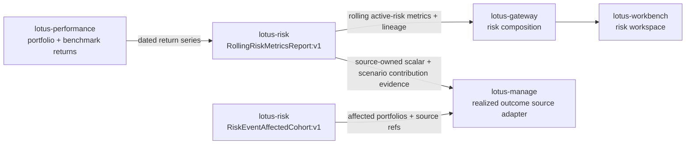

# Mesh Data Products

## Mesh role

`lotus-risk` is a maturity-wave producer in the Lotus enterprise data mesh.

## Governed product

- Product IDs:
  - `lotus-risk:RiskMetricsReport:v1`
  - `lotus-risk:DrawdownAnalyticsReport:v1`
  - `lotus-risk:RollingRiskMetricsReport:v1`
  - `lotus-risk:HistoricalRiskAttributionReport:v1`
  - `lotus-risk:ConcentrationRiskReport:v1`
  - `lotus-risk:RegimeScenarioPackEvaluation:v1`
  - `lotus-risk:RiskEventAffectedCohort:v1`
- Product role: governed risk analytics reports, scenario-pack evaluation outputs, and risk-event
  affected-cohort membership for advisory, reporting, gateway, Workbench discovery, manage
  construction-supportability, and future rebalance-wave trigger flows
- Source declaration: `contracts/domain-data-products/`
- Trust telemetry: `contracts/trust-telemetry/`

## Implementation-backed methodology coverage

`RollingRiskMetricsReport:v1` now has auditable source-owner methodology truth for rolling
volatility, rolling Sharpe, rolling beta, rolling tracking error, rolling information ratio, and
rolling maximum drawdown. The methodologies are tied to the implemented
`/analytics/risk/rolling-metrics` engine and state the exact percentage-point to decimal conversion,
`ddof=1` sample standard deviation/covariance/variance behavior where used, rolling maximum
drawdown cumulative-wealth/running-peak behavior, annualization basis where used, strict versus
partial minimum-observation behavior, warm-up null handling, risk-free and benchmark date-alignment
rules where required, no-aligned-dependency behavior, zero-excess-volatility Sharpe flagging,
zero-benchmark-variance beta flagging, zero-tracking-error information-ratio flagging, annualized
decimal volatility output, decimal-ratio tracking-error output, dimensionless Sharpe, beta, and
information-ratio output, and decimal drawdown-ratio output.

`RegimeScenarioPackEvaluation:v1` now carries source-owned scenario-pack evidence beyond aggregate
loss. When callers provide reconciled `exposure_components`, the product emits per-security
scenario contribution rows alongside worst-case loss, threshold-breach posture, lineage, and
bounded reason codes. The rows are contribution evidence for governed CIO shocks, not full
instrument repricing, and downstream proof packs must preserve them instead of rebuilding scenario
logic outside `lotus-risk`.

Audience notes:

- Business users can read rolling volatility as annualized portfolio-return dispersion, rolling
  Sharpe as annualized excess return per unit of portfolio excess-return volatility, rolling
  beta as sensitivity to benchmark return variance, rolling tracking error as annualized
  active-return volatility versus the selected benchmark, rolling information ratio as annualized
  active return per unit of that active risk, and rolling maximum drawdown as the worst decimal
  peak-to-trough loss inside each rolling return window.
- Operations teams can distinguish warm-up gaps, missing benchmark alignment, and upstream sourcing
  issues from calculation failure; missing risk-free alignment and zero-excess-volatility windows
  are explicit for Sharpe, zero-benchmark-variance windows are explicit for beta, and
  zero-tracking-error windows are flagged rather than promoted as valid ratios.
- Developers and downstream services must preserve `RollingRiskMetricsReport:v1` values and
  supportability metadata rather than recomputing rolling volatility, Sharpe, beta, tracking error,
  information ratio, or maximum drawdown locally.
- Developers and downstream services must preserve `RiskEventAffectedCohort:v1` membership,
  exclusions, source refs, and impact scores rather than reconstructing risk-event cohort
  membership locally.
- Developers and downstream services must preserve `RegimeScenarioPackEvaluation:v1` scenario
  results, per-security contribution rows, reason codes, and lineage rather than applying local
  scenario methodology in gateway, Workbench, reporting, or manage proof packs.
- Sales and pre-sales can describe the canonical capability as implementation-backed for supported
  seeded portfolios, while broader portfolio-archetype coverage still depends on live validation
  evidence.

## Platform relationship

`lotus-platform` aggregates the repo-native declaration, validates trust telemetry, applies mesh SLO/access/evidence policies, and includes this product in generated catalog, dependency graph, live certification, maturity matrix, evidence packs, and RFC-0092 operating reports.

## Operating rule

Risk product trust must include freshness, completeness, data quality, lineage, and upstream dependency posture. Do not present risk mesh posture as certified unless platform mesh certification passes.
