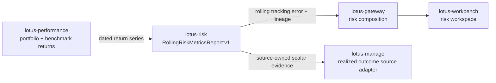

# Mesh Data Products

## Mesh role

`lotus-risk` is a maturity-wave producer in the Lotus enterprise data mesh.

## Governed product

- Product IDs:
  - `lotus-risk:RiskMetricsReport:v1`
  - `lotus-risk:DrawdownAnalyticsReport:v1`
  - `lotus-risk:RollingRiskMetricsReport:v1`
  - `lotus-risk:HistoricalRiskAttributionReport:v1`
  - `lotus-risk:ConcentrationRiskReport:v1`
  - `lotus-risk:RegimeScenarioPackEvaluation:v1`
- Product role: governed risk analytics reports and scenario-pack evaluation outputs for advisory,
  reporting, gateway, Workbench discovery, and manage construction-supportability flows
- Source declaration: `contracts/domain-data-products/`
- Trust telemetry: `contracts/trust-telemetry/`

## Implementation-backed methodology coverage

`RollingRiskMetricsReport:v1` now has auditable source-owner methodology truth for rolling tracking
error. The methodology is tied to the implemented `/analytics/risk/rolling-metrics` engine and
states the exact date-alignment rule, percentage-point to decimal conversion, `ddof=1` sample
standard deviation, annualization basis, strict versus partial minimum-observation behavior,
warm-up null handling, no-aligned-benchmark behavior, and decimal-ratio output mapping.

Audience notes:

- Business users can read rolling tracking error as annualized active-return volatility versus the
  selected benchmark.
- Operations teams can distinguish warm-up gaps, missing benchmark alignment, and upstream sourcing
  issues from calculation failure.
- Developers and downstream services must preserve `RollingRiskMetricsReport:v1` values and
  supportability metadata rather than recomputing rolling tracking error locally.
- Sales and pre-sales can describe the canonical capability as implementation-backed for supported
  seeded portfolios, while broader portfolio-archetype coverage still depends on live validation
  evidence.

## Platform relationship

`lotus-platform` aggregates the repo-native declaration, validates trust telemetry, applies mesh SLO/access/evidence policies, and includes this product in generated catalog, dependency graph, live certification, maturity matrix, evidence packs, and RFC-0092 operating reports.

## Operating rule

Risk product trust must include freshness, completeness, data quality, lineage, and upstream dependency posture. Do not present risk mesh posture as certified unless platform mesh certification passes.
