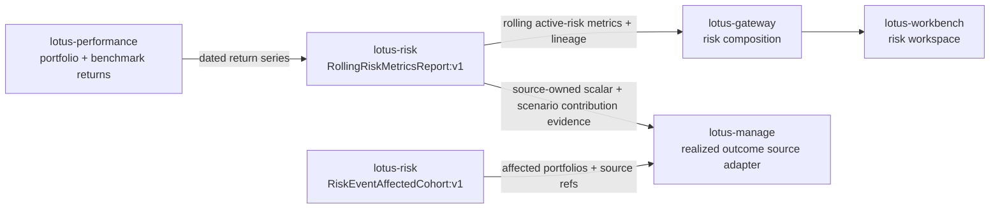

# Mesh Data Products

## Mesh role

`lotus-risk` is a maturity-wave producer in the Lotus enterprise data mesh.

## Governed product

- Product IDs:
  - `lotus-risk:RiskMetricsReport:v1`
  - `lotus-risk:DrawdownAnalyticsReport:v1`
  - `lotus-risk:RollingRiskMetricsReport:v1`
  - `lotus-risk:HistoricalRiskAttributionReport:v1`
  - `lotus-risk:ConcentrationRiskReport:v1`
  - `lotus-risk:RegimeScenarioPackEvaluation:v1`
  - `lotus-risk:RiskEventAffectedCohort:v1`
- Product role: governed risk analytics reports, scenario-pack evaluation outputs, and risk-event
  affected-cohort membership for advisory, reporting, gateway, Workbench discovery, manage
  construction-supportability, and future rebalance-wave trigger flows
- Source declaration: `contracts/domain-data-products/`
- Trust telemetry: `contracts/trust-telemetry/`

## Implementation-backed methodology coverage

`RiskMetricsReport:v1` now has auditable source-owner methodology truth for volatility, drawdown,
Sharpe, Sortino, VaR, beta, tracking error, and information ratio. The methodologies are tied to the implemented
`/analytics/risk/calculate` engine and state the exact percentage-point input convention, optional
log-return transform, frequency compounding before metric calculation, drawdown
cumulative-wealth/running-peak behavior, `ddof=1` sample standard
deviation/covariance/variance behavior, decimal volatility, risk-free, Sortino, VaR,
tracking-error, and information-ratio details, percentage-point-squared beta covariance/benchmark-variance
details, annualized percentage-point `metrics.VOLATILITY.value`, signed percentage-point
`metrics.DRAWDOWN.value`, dimensionless annualized `metrics.SHARPE.value`, dimensionless
annualized `metrics.SORTINO.value`, signed
percentage-point `metrics.VAR.value`, dimensionless slope `metrics.BETA.value`, annualized
percentage-point `metrics.TRACKING_ERROR.value`, dimensionless
annualized `metrics.INFORMATION_RATIO.value`, annualization-factor resolution where used,
benchmark dependency for beta, tracking error, and information ratio, no benchmark dependency for
Drawdown, Sharpe, Sortino, and VaR, no risk-free dependency for volatility, Drawdown, Sortino,
VaR, beta, tracking error, and information ratio, no-annualization-factor posture for Drawdown,
no-denominator posture for volatility and tracking error,
zero-volatility fail-closed posture for Sharpe, no-downside-observation fail-closed posture for Sortino,
signed VaR loss-threshold posture, square-root horizon scaling,
zero-benchmark-variance fail-closed posture for beta, zero-tracking-error fail-closed posture for
information ratio, constant-active-return zero tracking-error posture, and insufficient-data
failure behavior.

`RollingRiskMetricsReport:v1` now has auditable source-owner methodology truth for rolling
volatility, rolling Sharpe, rolling beta, rolling tracking error, rolling information ratio, and
rolling maximum drawdown. The methodologies are tied to the implemented
`/analytics/risk/rolling-metrics` engine and state the exact percentage-point to decimal conversion,
`ddof=1` sample standard deviation/covariance/variance behavior where used, rolling maximum
drawdown cumulative-wealth/running-peak behavior, annualization basis where used, strict versus
partial minimum-observation behavior, warm-up null handling, risk-free and benchmark date-alignment
rules where required, no-aligned-dependency behavior, zero-excess-volatility Sharpe flagging,
zero-benchmark-variance beta flagging, zero-tracking-error information-ratio flagging, annualized
decimal volatility output, decimal-ratio tracking-error output, dimensionless Sharpe, beta, and
information-ratio output, and decimal drawdown-ratio output.

`DrawdownAnalyticsReport:v1` now has auditable source-owner methodology truth for maximum
drawdown, average drawdown, ulcer index, and time under water. The methodologies are tied to the
implemented `/analytics/risk/drawdown` engine and state the exact percentage-point input
convention, decimal cumulative-wealth/running-peak drawdown behavior, decimal
`summary.max_drawdown` and `summary.average_drawdown` outputs, non-negative decimal
`summary.ulcer_index` output,
observation-count `summary.time_under_water_days` output, episode peak/trough/recovery semantics,
strictly-underwater average-drawdown inclusion, full-path squared drawdown inclusion for ulcer
index, strictly-underwater observation counting for time under water, empty-period insufficient-data
posture, never-underwater zero-drawdown posture, duration-unit day counter behavior, and the
boundary that episode-list filters do not change the summary maximum, average, ulcer-index, or
time-under-water drawdown values.

`ConcentrationRiskReport:v1` now has auditable source-owner methodology truth for position HHI and
top-position weight.
The methodology is tied to the implemented `/analytics/risk/concentration` engine and states the
stateless, stateful, and simulation source paths, positive numeric value extraction, market-value
versus quantity fallback precedence, decimal position-weight construction, conventional `0..10000`
Herfindahl-Hirschman scaling for HHI, decimal `0..1` top-position weight output, six-decimal
response rounding, proposed-state fallback to current values when projected values are
unavailable, deterministic top-position driver selection, input-universe option boundaries, and
issuer-enrichment isolation from `risk_proxy.hhi_*` and
`single_position_concentration.top_position_*` outputs.

`RegimeScenarioPackEvaluation:v1` now carries source-owned scenario-pack evidence beyond aggregate
loss. When callers provide reconciled `exposure_components`, the product emits per-security
scenario contribution rows alongside worst-case loss, threshold-breach posture, lineage, and
bounded reason codes. The rows are contribution evidence for governed CIO shocks, not full
instrument repricing, and downstream proof packs must preserve them instead of rebuilding scenario
logic outside `lotus-risk`.

Audience notes:

- Business users can read rolling volatility as annualized portfolio-return dispersion, rolling
  Sharpe as annualized excess return per unit of portfolio excess-return volatility, rolling
  beta as sensitivity to benchmark return variance, rolling tracking error as annualized
  active-return volatility versus the selected benchmark, rolling information ratio as annualized
  active return per unit of that active risk, and rolling maximum drawdown as the worst decimal
  peak-to-trough loss inside each rolling return window.
- Business users can read `DrawdownAnalyticsReport:v1` maximum drawdown as the worst decimal
  peak-to-trough portfolio loss for the resolved period, and average drawdown as the mean decimal
  depth across strictly underwater observations. Ulcer index is the non-negative decimal
  root-mean-square drawdown severity over the full drawdown path. Time under water is the count of
  portfolio return observations that are strictly below the running peak; duration-unit settings
  affect episode day counters, not this observation count.
- Business users can read `RiskMetricsReport:v1` volatility as annualized portfolio-return
  dispersion in percentage points for the resolved period, Drawdown as signed percentage-point
  maximum peak-to-trough loss, Sharpe as annualized excess return per
  unit of portfolio return volatility, Sortino as annualized excess return over MAR per unit of
  downside deviation, and VaR as a signed lower-tail return threshold in percentage points. Beta is
  the period sensitivity slope of portfolio returns to benchmark return
  variance after strict date alignment, and tracking error is annualized active-return volatility
  versus the selected benchmark for the resolved period. Information ratio is annualized active
  return per unit of tracking error for the same period.
- Operations teams can distinguish warm-up gaps, missing benchmark alignment, and upstream sourcing
  issues from calculation failure; missing risk-free alignment and zero-excess-volatility windows
  are explicit for Sharpe, zero-benchmark-variance windows are explicit for beta, and
  zero-tracking-error windows are flagged rather than promoted as valid ratios.
- Developers and downstream services must preserve `RollingRiskMetricsReport:v1` values and
  supportability metadata rather than recomputing rolling volatility, Sharpe, beta, tracking error,
  information ratio, or maximum drawdown locally.
- Developers and downstream services must preserve `DrawdownAnalyticsReport:v1` maximum drawdown,
  average drawdown, ulcer index, time-under-water, episode, underwater-series, and
  relative-drawdown context rather than recomputing drawdown analytics locally.
- Developers and downstream services must preserve `RiskMetricsReport:v1` volatility, drawdown,
  Sharpe, Sortino, VaR, beta, tracking-error, and information-ratio values and supportability metadata rather than
  recomputing period risk metrics locally.
- Developers and downstream services must preserve `ConcentrationRiskReport:v1` position HHI and
  related concentration outputs rather than recomputing concentration locally.
- Developers and downstream services must preserve `RiskEventAffectedCohort:v1` membership,
  exclusions, source refs, and impact scores rather than reconstructing risk-event cohort
  membership locally.
- Developers and downstream services must preserve `RegimeScenarioPackEvaluation:v1` scenario
  results, per-security contribution rows, reason codes, and lineage rather than applying local
  scenario methodology in gateway, Workbench, reporting, or manage proof packs.
- Sales and pre-sales can describe the canonical capability as implementation-backed for supported
  seeded portfolios, while broader portfolio-archetype coverage still depends on live validation
  evidence.

## Platform relationship

`lotus-platform` aggregates the repo-native declaration, validates trust telemetry, applies mesh SLO/access/evidence policies, and includes this product in generated catalog, dependency graph, live certification, maturity matrix, evidence packs, and RFC-0092 operating reports.

## Operating rule

Risk product trust must include freshness, completeness, data quality, lineage, and upstream dependency posture. Do not present risk mesh posture as certified unless platform mesh certification passes.
