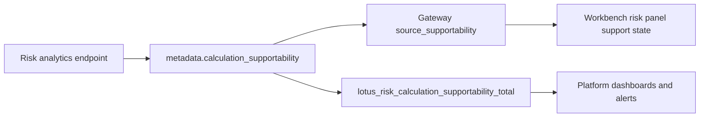

# Operations Runbook

## Operational Entry Points

The most important operator-facing endpoints are:

- `/health`
- `/health/live`
- `/health/ready`
- `/metadata`
- `/ops`
- `/metrics`

Use this first-pass sequence:

1. `/health/live`
2. `/health/ready`
3. `/ops`
4. `/metadata`

## What `/health/ready` and `/ops` Tell You

These endpoints are more useful than a plain process-up check.

They tell you:

1. whether dependency configuration is healthy,
2. whether `lotus-core` and `lotus-performance` are reachable,
3. whether the service is draining,
4. whether a stateful analytics path is likely to succeed.

## Canonical Local Upstreams

For direct local validation:

1. `lotus-risk` -> `http://localhost:8130`
2. `lotus-performance` -> `http://localhost:8002`
3. `lotus-core` query control-plane -> `http://localhost:8202`

In Docker Compose, the service uses canonical hostnames mapped back to the host gateway:

1. `performance.dev.lotus`
2. `core-control.dev.lotus`

## Common Misconfiguration

The most common local configuration mistake is wrong upstream routing.

Examples:

1. pointing `LOTUS_PERFORMANCE_BASE_URL` at a `lotus-core` port,
2. pointing `LOTUS_CORE_BASE_URL` at the wrong lotus-core surface,
3. assuming all stateful failures are analytics bugs when they are really upstream URL or supportability issues.

## Live Validation Baseline

Current governed default:

1. portfolio `PB_SG_GLOBAL_BAL_001`
2. as-of date `2026-03-31`

This is strong canonical evidence, but not a full enterprise archetype matrix.

## Diagnostic Sources

Use:

1. `/ops`
2. `/metrics`
3. container logs,
4. `docs/operations/canonical-local-upstream-urls.md`
5. `docs/operations/live-risk-validation-matrix.md`

For risk analytics responses, `metadata.calculation_supportability` is emitted by `risk/calculate`,
drawdown, rolling metrics, historical attribution, and concentration. Use it before inferring UI
state from individual metric values, period errors, issuer coverage, or stale returns. It reports
bounded `ready`, `stale`, `degraded`, or `empty` posture, a bounded reason, and a freshness bucket.
Historical attribution responses are degraded when any attribution set emits quality flags such as
missing grouping data, empty active-risk alignment, or unsupported attribution combinations.
The matching Prometheus counter is
`lotus_risk_calculation_supportability_total` with only bounded labels: `operation`,
`supportability_state`, `reason`, and `freshness_bucket`.
The same source-owned posture also increments the RFC-0108 cross-service freshness counter
`lotus_analytics_freshness_bucket_total{service="lotus-risk",operation,freshness_bucket,supportability_state}`.

The response contract publishes `metadata.calculation_supportability.metric_labels` so operators
can verify the metric-label contract directly from the API response. Do not add portfolio, account,
client, correlation, trace, transaction, request-body, response-body, or security identifiers to
supportability metric labels.

When the question is "should this workflow be offered at all?" also check:

1. `/integration/capabilities`

That endpoint is not only for gateway discovery. It is also a fast operator check for whether a
mode or workflow is intentionally unsupported versus operationally failing.

## Detailed Runbook Sources

- `docs/runbooks/service-operations.md`
- `docs/operations/canonical-local-upstream-urls.md`
- `docs/operations/live-risk-validation-matrix.md`

## Read Next

1. use [Troubleshooting](./Troubleshooting.md) for common failure patterns,
2. use [Integrations](./Integrations.md) when the issue is really a downstream contract interpretation problem,
3. use [Security and Governance](./Security-and-Governance.md) when supportability claims are at stake.
