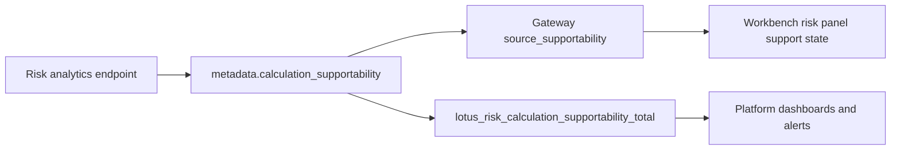

# Operations Runbook

## Operational Entry Points

The most important operator-facing endpoints are:

- `/health`
- `/health/live`
- `/health/ready`
- `/metadata`
- `/version`
- `/ops`
- `/metrics`

Use this first-pass sequence:

1. `/health/live`
2. `/health/ready`
3. `/ops`
4. `/metadata` or `/version`

## CI-Local Container Isolation

Run `make ci-local-docker` for the isolated split-suite container gate and
`make ci-local-docker-down` to remove its resources. Both commands use the same checkout-specific
Compose project name, derived from the resolved checkout path. Cleanup affects only that CI-local
project and must not stop or remove the product runtime started from `docker-compose.yml`.

`CI_LOCAL_COMPOSE_PROJECT` is an explicit override for operators who need a different isolated
namespace; use the same value for bring-up and cleanup.

`/metadata` and `/version` expose identical service, policy, build, image, and CI provenance:
Git commit SHA, branch/ref, build timestamp, repository URL, image digest, and CI pipeline/run ID.
The final image digest is supplied by registry/deployment metadata through `LOTUS_IMAGE_DIGEST`;
local unpublished builds report an explicit unavailable value.

## What `/health/ready` and `/ops` Tell You

These endpoints are more useful than a plain process-up check.

They tell you:

1. whether dependency configuration is healthy,
2. which `lotus-core` and `lotus-performance` base URLs are configured,
3. whether the service is draining,
4. whether an explicit runtime override has marked a dependency degraded or unavailable.

They do not actively probe upstream reachability. A dependency row with `status: "configured"` and
`detail: "configured_only_no_probe"` is a configured-only signal. To diagnose live upstream
reachability or data-contract failures, use endpoint-level error responses,
`metadata.calculation_supportability`, `lotus_risk_upstream_requests_total`, and the upstream
dependency alert steps below.

## Canonical Local Upstreams

For direct local validation:

1. [lotus-risk local API](http://localhost:8130)
2. [lotus-performance local API](http://localhost:8002)
3. [lotus-core query control-plane](http://localhost:8202)

In Docker Compose, the service uses canonical hostnames mapped back to the host gateway:

1. `performance.dev.lotus`
2. `core-control.dev.lotus`

The FastAPI lifespan owns one reusable HTTP connection pool for each upstream dependency. On
shutdown, the service enters draining posture and closes those owned pools. A production ASGI
runtime must keep lifespan support enabled so configured keepalive and connection limits are
effective.

## Common Misconfiguration

The most common local configuration mistake is wrong upstream routing.

Examples:

1. pointing `LOTUS_PERFORMANCE_BASE_URL` at a `lotus-core` port,
2. pointing `LOTUS_CORE_BASE_URL` at the wrong lotus-core surface,
3. assuming all stateful failures are analytics bugs when they are really upstream URL or supportability issues.

## Enterprise Deployment Security

Bank deployment mode must enable enterprise authorization and runtime configuration enforcement,
configure primary key and secret-rotation evidence, configure endpoint capability rules, and align
ingress/proxy plus ASGI/server request body limits with `ENTERPRISE_MAX_WRITE_PAYLOAD_BYTES`.
Startup verifies `ENTERPRISE_INGRESS_MAX_BODY_BYTES` and `ENTERPRISE_ASGI_MAX_BODY_BYTES` as
machine-readable proof of those external limits.
Missing ingress/server body-limit enforcement for requests without trustworthy `Content-Length` is
a deployment-readiness failure.
`/ops`, `/ops/trust-telemetry`, and `/metrics` also require the trusted-ingress marker in enterprise
mode; health and readiness probes remain available for platform orchestration.

With `ENTERPRISE_ENFORCE_RUNTIME_CONFIG=true`, startup fails closed when the in-process bank posture
is incomplete. Resolve every bounded `enterprise_runtime_config_invalid:<issue-codes>` entry before
promoting the deployment.

## Live Validation Baseline

Current governed default:

1. portfolio `PB_SG_GLOBAL_BAL_001`
2. as-of date `2026-03-31`

This is strong canonical evidence, but not a full enterprise archetype matrix.

## Diagnostic Sources

Use:

1. `/ops`
2. `/metrics`
3. container logs,
4. `docs/operations/canonical-local-upstream-urls.md`
5. `docs/operations/live-risk-validation-matrix.md`
6. `docs/domain-apis/risk-observability.md`

Request logs expose a structured `request_observation` event with bounded service, method, path,
status, correlation, trace, latency, and risk fields. Query strings and request/response bodies are
deliberately excluded.

For risk analytics responses, `metadata.calculation_supportability` is emitted by `risk/calculate`,
drawdown, rolling metrics, historical attribution, and concentration. Use it before inferring UI
state from individual metric values, period errors, issuer coverage, or stale returns. It reports
bounded `ready`, `stale`, `degraded`, or `empty` posture, a bounded reason, and a freshness bucket.
Historical attribution responses are degraded when any attribution set emits quality flags such as
missing grouping data, empty active-risk alignment, or unsupported attribution combinations.
Endpoint execution failures in `lotus_risk_endpoint_executions_total` include service-operation
exceptions and invalid responses that fail response-model validation before endpoint success is
recorded.
The matching Prometheus counter is
`lotus_risk_calculation_supportability_total` with only bounded labels: `operation`,
`supportability_state`, `reason`, and `freshness_bucket`.
The same source-owned posture also increments the RFC-0108 cross-service freshness counter
`lotus_analytics_freshness_bucket_total{service="lotus-risk",operation,freshness_bucket,supportability_state}`.
HTTP status posture is exposed through
`http_requests_total{handler,method,status}`; use the HTTP 5xx alert path in
`docs/runbooks/service-operations.md#http-5xx-alert` when handlers emit `5xx` responses.

The response contract publishes `metadata.calculation_supportability.metric_labels` so operators
can verify the metric-label contract directly from the API response. Do not add portfolio, account,
client, correlation, trace, transaction, request-body, response-body, or security identifiers to
supportability metric labels.

When the question is "should this workflow be offered at all?" also check:

1. `/integration/capabilities`

That endpoint is not only for gateway discovery. It is also a fast operator check for whether a
mode or workflow is intentionally unsupported versus operationally failing.

## Detailed Runbook Sources

- `docs/runbooks/service-operations.md`
- `docs/operations/canonical-local-upstream-urls.md`
- `docs/operations/live-risk-validation-matrix.md`

## Read Next

1. use [Troubleshooting](./Troubleshooting.md) for common failure patterns,
2. use [Integrations](./Integrations.md) when the issue is really a downstream contract interpretation problem,
3. use [Security and Governance](./Security-and-Governance.md) when supportability claims are at stake.
